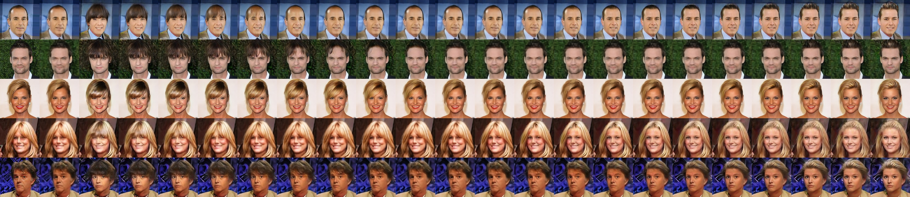
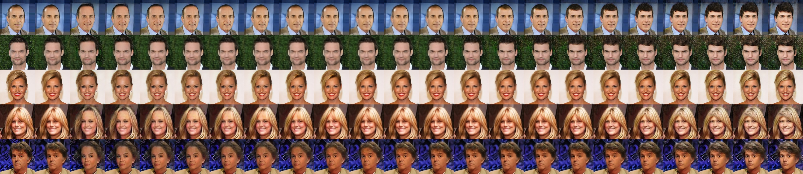
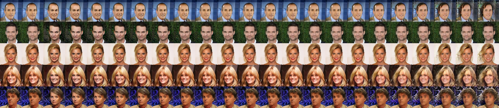
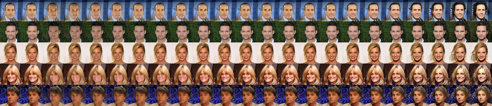
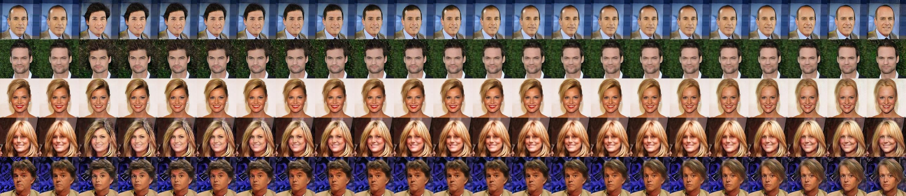
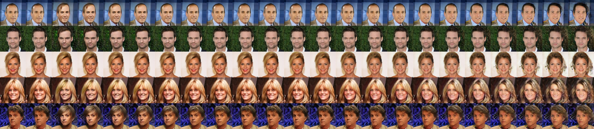
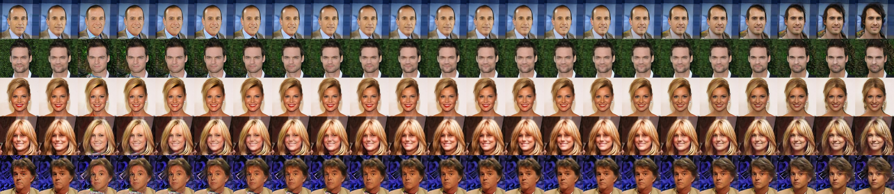
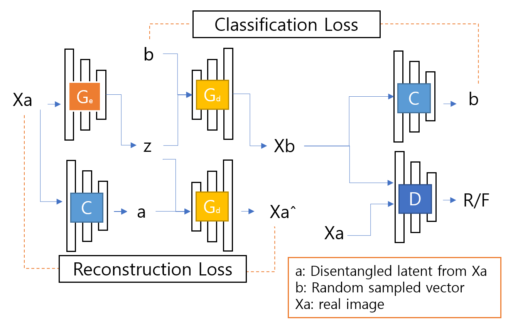

# BicycleEigenGAN
- Combine BicycleGAN(idea of using latent classifier as style encoder) and EigenGAN
- Way to translate input image with disentangled latent input
- Most code brought from [AttGAN](https://github.com/LynnHo/AttGAN-Tensorflow) and [EigenGAN](https://github.com/LynnHo/EigenGAN-Tensorflow)     


# Result   
- epoch 61 trained model output (img size 128, g recon loss 100.0, z_dims 7 * 7)
- first col / second col / remian col    
- ori source img / reconstruction img / output results when set value -4.5 to 4.5

    
     
    
    
    
    
    


# Model structure
    

# Run    
- bicycleEigenGAN.ipynb


## Setup (brought from EigenGAN)
- Environment

    - Python 3.6

    - TensorFlow 1.15

    - OpenCV, scikit-image, tqdm, oyaml

    - *we recommend [Anaconda](https://www.anaconda.com/distribution/#download-section) or [Miniconda](https://docs.conda.io/en/latest/miniconda.html#linux-installers), then you can create the environment with commands below*

        ```console
        conda create -n EigenGAN python=3.6

        source activate EigenGAN

        conda install opencv scikit-image tqdm tensorflow-gpu=1.15

        conda install -c conda-forge oyaml
        ```

    - *NOTICE: if you create a new conda environment, remember to activate it before any other command*

        ```console
        source activate EigenGAN
        ```

- Data Preparation

    - [CelebA](http://openaccess.thecvf.com/content_iccv_2015/papers/Liu_Deep_Learning_Face_ICCV_2015_paper.pdf)-unaligned (10.2GB, higher quality than the aligned data)

        - download the dataset

            - img_celeba.7z (move to **./data/img_celeba/img_celeba.7z**): [Google Drive](https://drive.google.com/drive/folders/0B7EVK8r0v71pTUZsaXdaSnZBZzg) or [Baidu Netdisk](https://pan.baidu.com/s/1CRxxhoQ97A5qbsKO7iaAJg) (password rp0s)

            - annotations.zip (move to **./data/img_celeba/annotations.zip**): [Google Drive](https://drive.google.com/file/d/1xd-d1WRnbt3yJnwh5ORGZI3g-YS-fKM9/view?usp=sharing)

        - unzip and process the data

            ```console
            7z x ./data/img_celeba/img_celeba.7z/img_celeba.7z.001 -o./data/img_celeba/

            unzip ./data/img_celeba/annotations.zip -d ./data/img_celeba/

            python ./scripts/align.py
            ```


# TODO
- ResNet
- Vae
- random z input
- tune hyperparameter 
- test quality using Fréchet Inception Distance
- test diversity using [lpips](https://github.com/richzhang/PerceptualSimilarity)

# Acknowledgement and References  
- [AttGAN](https://github.com/LynnHo/AttGAN-Tensorflow)     
- [EigenGAN](https://github.com/LynnHo/EigenGAN-Tensorflow)     
- [BicycleGAN](https://github.com/junyanz/BicycleGAN)
- [BicycleGAN-Tensorflow](https://github.com/clvrai/BicycleGAN-Tensorflow)
- [Bidirectional-InfoGAN](https://github.com/tohinz/Bidirectional-InfoGAN)
- [lpips](https://github.com/richzhang/PerceptualSimilarity)
- 
